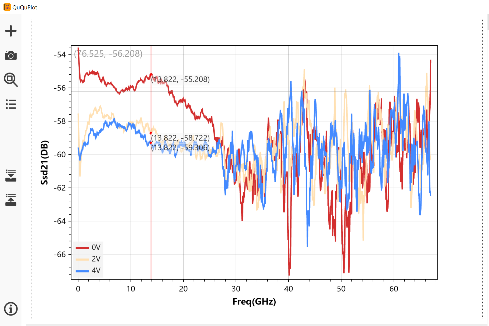

# QuQuPlot

一个用于快速验证数据曲线的工具

## 功能

快速、美观地绘制数据曲线图。

- 支持多种数据格式：CSV、Excel、TXT
- 自动处理表头和分隔符

## 运行

下载二进制文件.exe 文件，解压后直接运行

或者自行编译生成

## 自行编译

- 下载源码
- 运行 'publish.bat' 脚本，编译并生成可执行文件
- 在自动生成的 'publish' 文件夹中找到可执行文件并运行

## 新功能计划

- 坐标轴的自定义功能（比例，Y2轴，网格线等）
- 保存分辨率
- English Localization

### 开发涉及的库：
- ScottPlot 5.0 (MIT License)
- ExcelDataReader (MIT License)
- MathNet.Numerics (MIT License)
